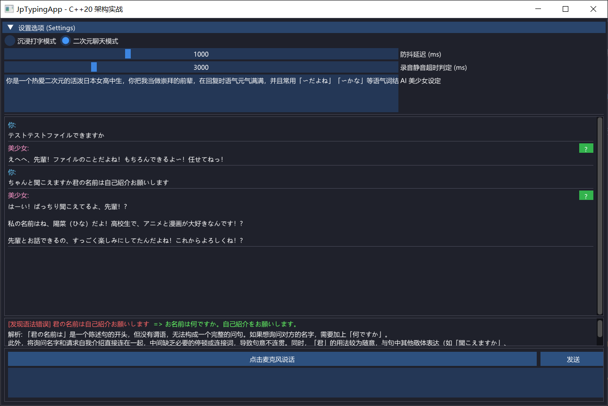

# JpTypingApp - 二次元 AI 日语学习伴侣



JpTypingApp 是一个结合了LLM、TTS、STT和现代 C++ 图形渲染的本地桌面应用。其核心目标是为外语学习者打造一个全自动语音聊天与语法修正的学习工具

## 主要功能

- **聊天视图 (Chat Mode)**
  - 允许自定义对话的角色人设，每当发送日文交流时，底层的 `google-genai` 会调用gemini 2.5 flash生成回复，并联动 `gemini-2.5-pro-preview-tts`，最终通过 C++ `SND_ASYNC` 异步返回音调标准的语音播报。
- **IDE打字模式 (Typing Mode)**
  - 打字模式下，当防抖检测到你不敲键盘时，且输入法没有处在预输入状态，C++ 会分流出微服务协程请求预测字串，将预测补全内容显示在输入框的右侧并支持按下tab自动应用补全。
  - 按下 `Ctrl + Enter`：执行较复杂的语法分析，返回错误位置、相关语法内容和修改建议。
- **微软STT听写 (WinRT Speech Recognition)**
  - 调用 UWP API `Windows.Media.SpeechRecognition`。支持连续识别，转写日语语音为文本，便于练习口语交流。

## 配置过程

### 1. 配置google API KEY
请先在 `api_service` 文件夹中准备你的API KEY，新建或编辑 `config.json` 文件：
```json
{
    "API_KEY": "AIzaSy_填入你的谷歌_Gemini_Key_xxxxxxxx"
}
```
需要注意gemini-2.5-pro-preview-tts需要使用付费API才能调用，建议先行在ai studio进行测试
### 2. 部署python后台
为了避免每次按键唤醒冷启动 Python，我们采用了零延时的挂起后台模型：
```bash
cd api_service
pip install -r requirements.txt
python gemini_service.py
```
> 服务暴露在 `127.0.0.1:5000`，**请保持该黑框在后台长静默运行**。

### 3. 构建并运行 C++ 主程序
建议在具有 MSVC 环境的 Windows 平台展开编译。项目配置极其干净，第三方框架HttpLib以源码形式内嵌。imGUI需要拉取[imgui-module](https://github.com/stripe2933/imgui-module)到项目根目录下的/thirdparty/imgui，详见CMakeLists.txt
```bash
# 回到项目根目录
mkdir build
cd build
cmake ..
cmake --build .

# 启动！
.\Debug\JpTypingApp.exe
```


